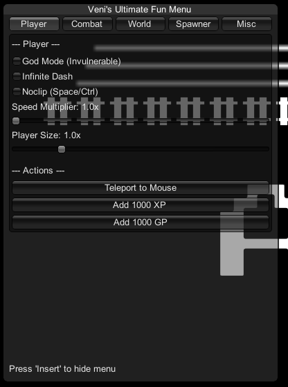

* Ampersat

**Type of file**
* Mod

***

### **Mod details**

**Mod name**
* Veni's Ultimate Fun Menu

**Mod language**
* English

**Current version**
* 2.2.1

**Author or team name**
* Veni

**Brief overview**
* A massive cheat menu with a clean UI that gives you full control over the game. Features God Mode, noclip, stat modifiers, an enemy spawner, time control, homing projectiles, and tons of other fun options to completely break the game your way. Open and close the menu with the 'Insert' key.

[size=5][b]Veni's Ultimate Fun Menu[/b][/size]

This mod adds a powerful, easy-to-use cheat menu to Ampersat, letting you customize your gameplay experience with a huge variety of fun and game-breaking options. The menu is organized into tabs to keep things clean and simple.

Just press the [b]Insert[/b] key to open and close the menu!

[line]

[size=4][b]Installation[/b][/size]
1. Make sure you have MelonLoader installed for Ampersat.
2. Download the DLL file from the files tab.
3. Place the `TestMod.dll` file into your `Mods` folder inside the Ampersat game directory.
4. Launch the game, and the mod will be active!

[line]

[size=4][b]Features[/b][/size]

[b]Player Tab:[/b]
[list]
[*]God Mode (become invulnerable)
[*]Infinite Dash
[*]Noclip (fly through walls, use Space/Ctrl to go up/down)
[*]Customizable Speed Multiplier
[*]Player Size Slider
[*]Teleport to Mouse Cursor
[*]Add XP and GP buttons
[/list]
[b]Combat Tab:[/b]
[list]
[*]No Attack Cooldowns
[*]No Ranged Weapon Overheat
[*]Always Land Critical Hits
[*]Reflect Status Effects onto enemies
[*]Infinite Projectile Ricochet
[*]Homing Projectiles
[*]"Meme Damage" text (changes damage numbers to "pwned")
[*]Auto-Switch Spells
[*]Customizable Knockback Multiplier
[*]Kill All Enemies button
[*]Max Out Stats button
[/list]
[b]World Tab:[/b]
[list]
[*]Disable All Traps
[*]Make Traps Hit Enemies
[*]Time Scale Slider (slow down or speed up the game)
[/list]
[b]Spawner Tab:[/b]
[list]
[*]Instantly hatch all Egg Bursters on the map
[*]Spawn any enemy from a list right next to you
[/list]
[b]Misc Tab:[/b]
[list]
[*]Disco Mode (makes your character spin for fun)
[/list]
[line]

Enjoy the chaos!

